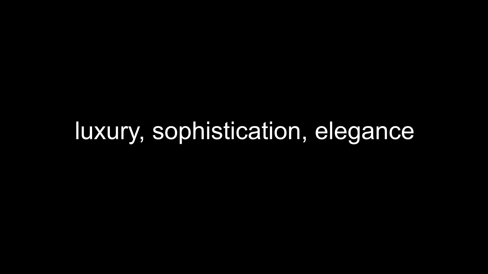
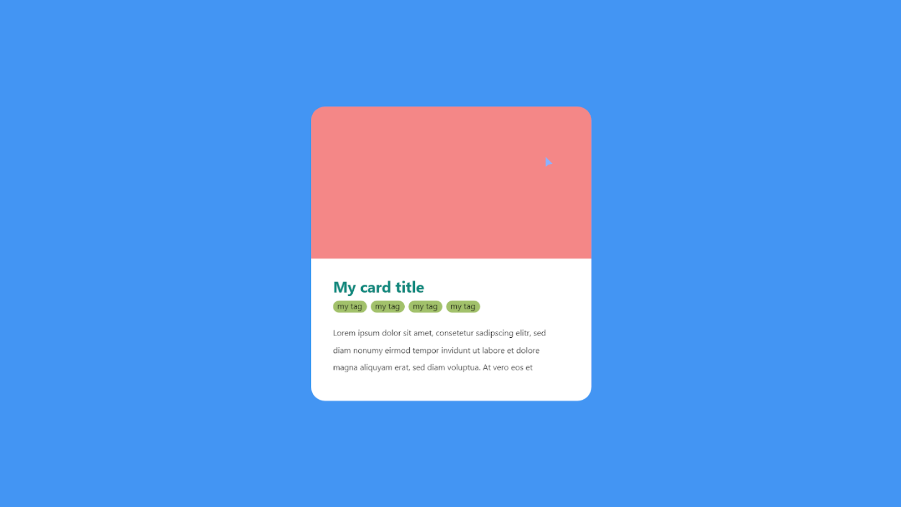
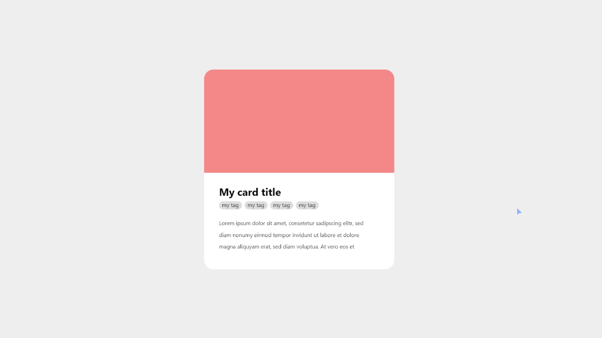
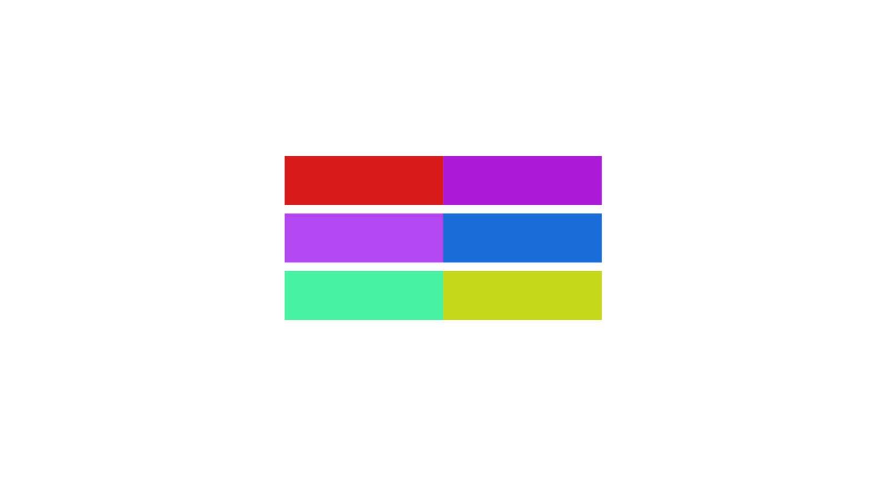
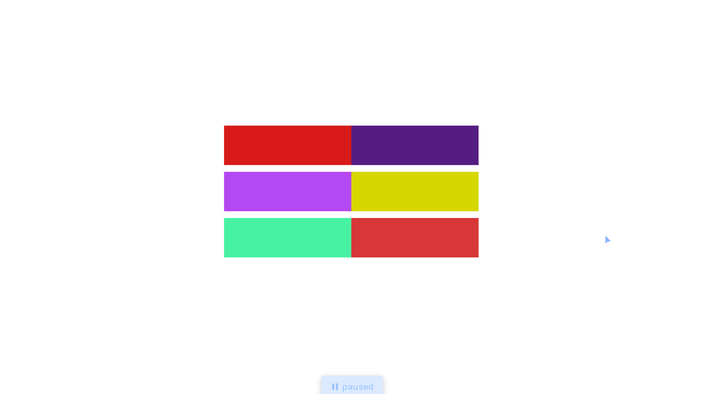
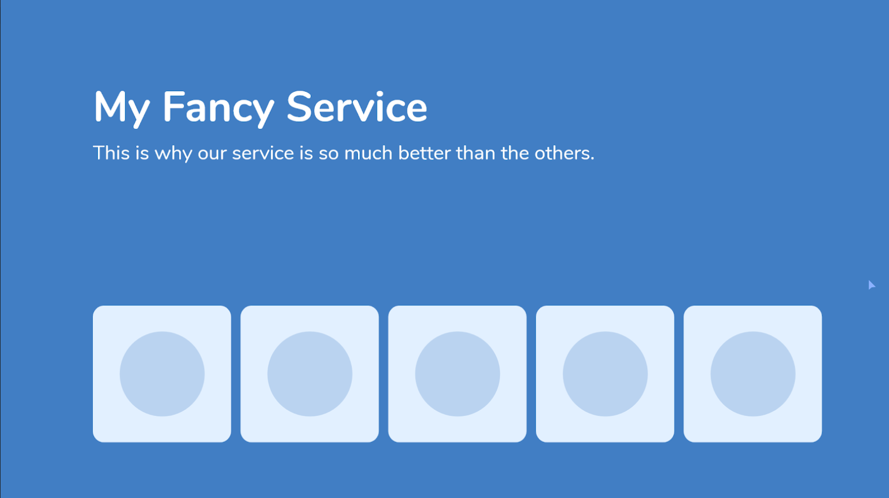
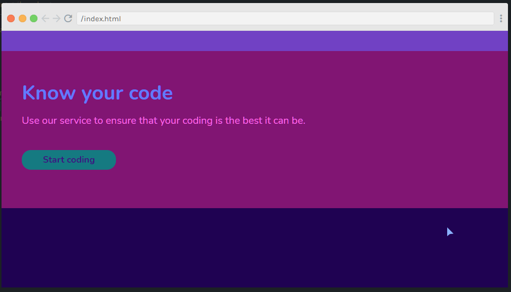

# Color

## Color Psychology

</p

## Too Much Color

Worst | Better
:-----:|:--------:
 | 

## Complement Color

Not Complement | Complement
:-----:|:--------:
 | 

## Lightness / Darkness

Without Darkness | With Darkness
:-----:|:--------:
 | 

## Problem

Before | After
:-----:|:--------:
 | 
