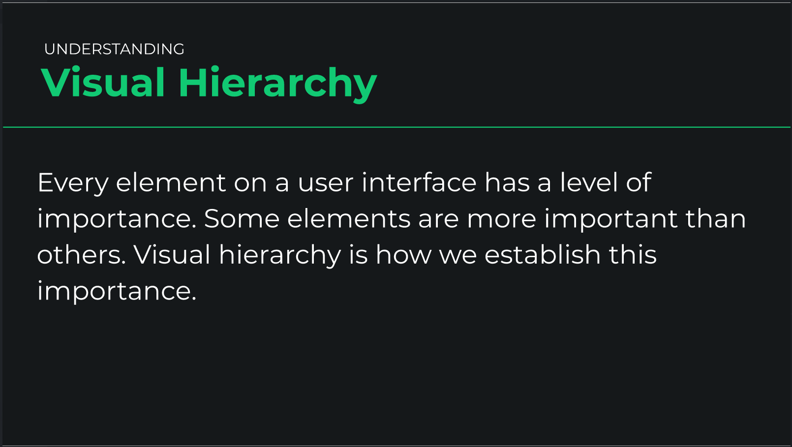
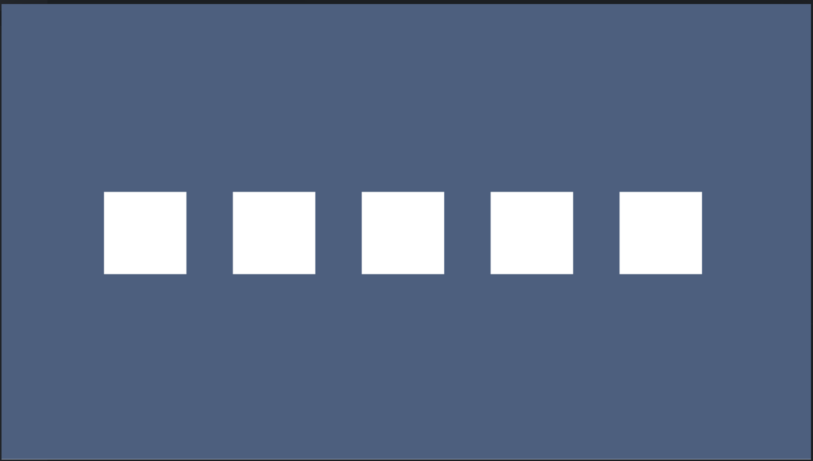
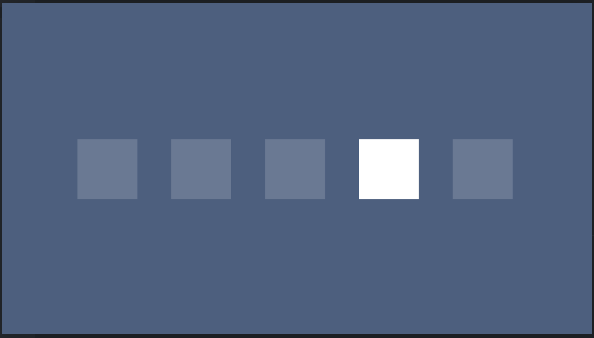
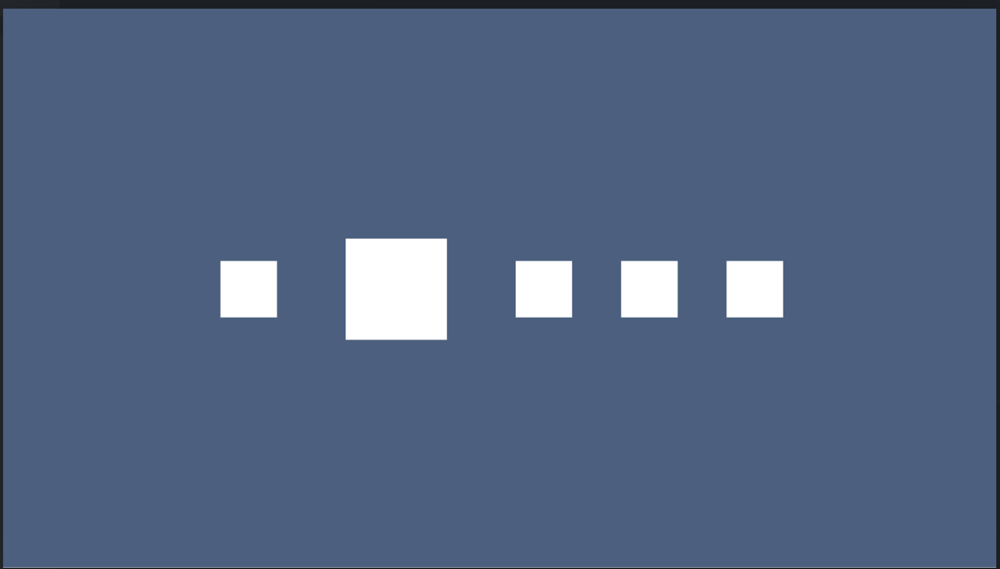
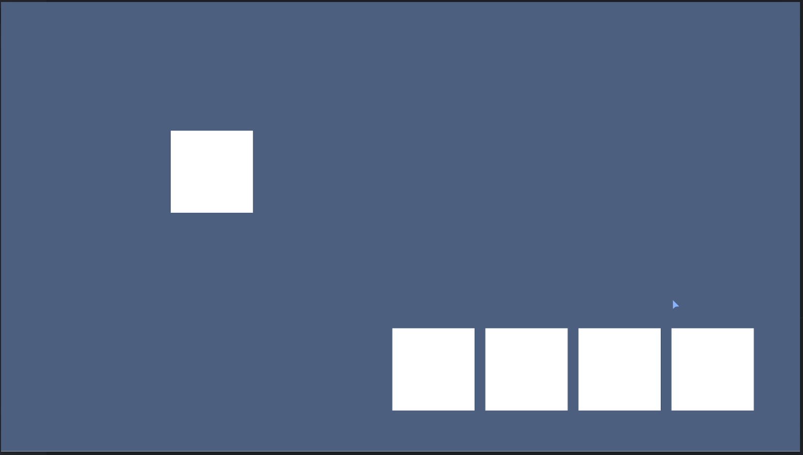
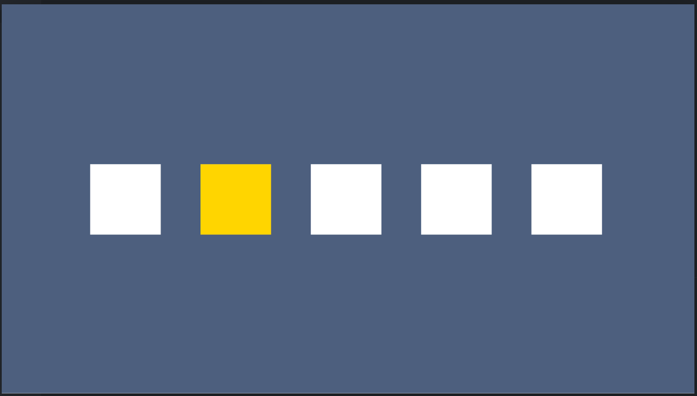

# Visual Hierarchy

## No Visual Hierarchy

## Contrast as Visual Hierarchy

## Scale as Visual Hieararchy

## Whitespace + Alignment as Visual Hierarchy

## Color as Visual Hierarchy

## Multiple UI Design Fundamental as Visual Hierarchy

## Problem

Before | After
:-----:|:--------:
 | 